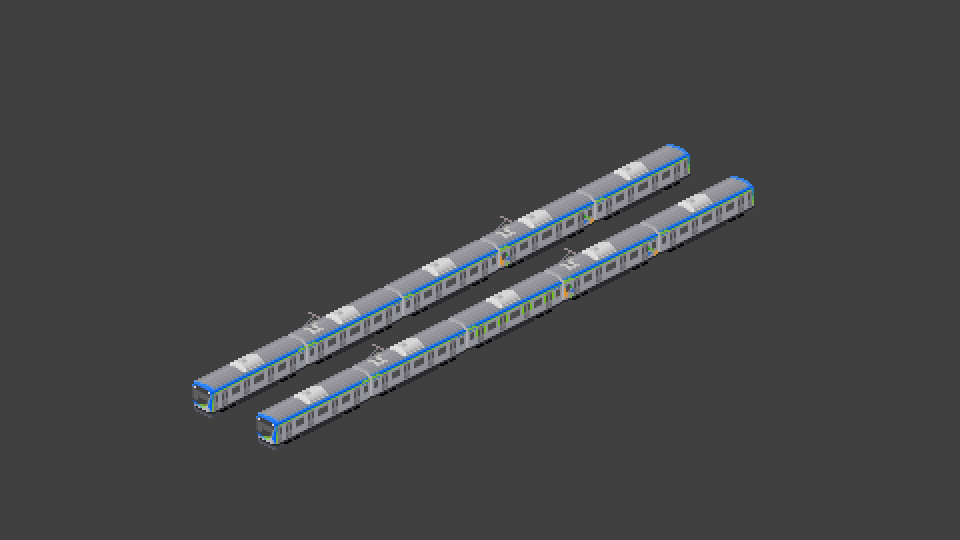

# 東武80000系

このアドオンはM_kasumi氏 東武60000系を参考にしました。

東武野田線の新型・80000系のアドオンです。

M_kasumi製60000系の5両のスペックに合わせています。

標準的な組成は以下の通りです。
60000系からの転用車を仮に83510型としています。
|1号車(Tc)|2号車(M)|3号車(T)|4号車(M)|5号車(Tc)|
|:-:|:-:|:-:|:-:|:-:|
|85500|84500|83500 83510|82500 (たのしーと)|81500|

ある程度自由に組成できるようにしているので、たのしーと抜きや東京メトロ17000のような組成も組めます。
