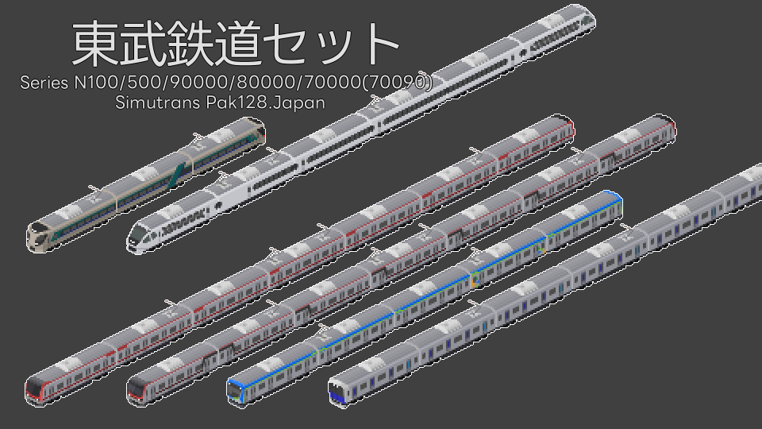

# 東武鉄道セット
- 作者：[あるみどり/G_alumi](https://x.com/G_alumi)
- ライセンス：CC BY-NC-SA

自分が作った東武電車まとめ的なセットです。あんまり脈絡はないですが、強いて言えば新しいもの中心。

## 更新履歴
### v1.0.1
- 90000系を追加
- 80000系のスペックを実車に合わせて修正
- N100系、500系、70000系をこちらにも追加(別で公開しているものと同じものです。)

### v1.0.0
- 80000系を追加

## 車両紹介
### N100系(スペーシアX)
- 個室の6号車(N100-1)、プレミアムシートの2号車(N100-5)が一等、その他レギュラーシートなどは二等
- 全車両一等
の2種類の仕様を同梱しています。

レギュラーシートの3,4号車を無限に足せます、増やしても加速度が狂わないように調整しています。

### 500系(リバティ/Revaty)
- 着席定員の一等仕様
- 立席含めた定員の二等仕様
3両固定編成で、上記の2種類の仕様を同梱しています。

### 90000系(東上線)
このアドオンはM_kasumi氏 東武50000/60000系を参考にしました。

M_kasumi製50070系の10両のスペックに合わせています。

プレス出てすぐ作ったやっつけ仕様です。
フリースペース横の扉の色が違うように見えたので副都心線系統のフリースペース設置位置と合わせています。(10~3号車が後ろ側、2,1号車が前側)
|10号車(Tc)|9号車(M)|8号車(T)|7号車(M)|6号車(T)|5号車(T)|4号車(M)|3号車(T)|2号車(M)|1号車(Tc)|
|:-:|:-:|:-:|:-:|:-:|:-:|:-:|:-:|:-:|:-:|
|910000|92000|93000|92000|93000|93000|92000|93000|99000|90000|

### 80000系(アーバンパークライン)
このアドオンはM_kasumi氏 東武60000系を参考にしました。

M_kasumi製60000系の5両のスペックに合わせています。

プレス出てすぐ作ったやっつけ仕様です。
フリースペース横の扉の色が違うように見えたので副都心線系統のフリースペース設置位置と合わせています。(10~3号車が後ろ側、2,1号車が前側)
|1号車(Tc)|2号車(M)|3号車(T)|4号車(M)|5号車(Tc)|
|:-:|:-:|:-:|:-:|:-:|
|85500|84500|83500 83510|82500 (たのしーと)|81500|

### 70000系/70090系(スカイツリーライン)
ある程度自由に組めます。以下に実車の編成を基にした組成を記しますが、全0.5Mなのでどんな組成でも加速度に大差ないと思います。

|7号車(Mc)|6号車(M)|5号車(T)|4号車(M)|3号車(M)|2号車(M)|1号車(Mc)|
|:-:|:-:|:-:|:-:|:-:|:-:|:-:|
|71700|72700|73700|74700|73700|72700|77700|